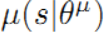
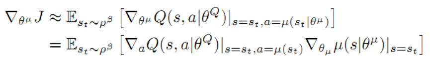
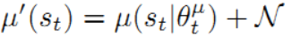

# Report

## Introduction

In this project our goal is to train two agents each having control of a racket in Unity's Tennis environment so that the agents learn to bounce a ball over a net for as long as possible in an episode.
According to the environment, **a reward of +0.1 is received each time an agent hits the ball over the net. If an agent lets the ball hit the ground or hits the ball out of bounds, it receives a reward of -0.01.** 
Since both the agents have the same goal they need to work together, hence the problem is a Collaborative MultiAgent environment problem.

The simulated environment provides a simplified **state space having 8 variables** corresponding to position and velocity of the ball and racket. Each agent receives its own local observation. **There are two actions in continuous domain corresponding to movement toward (or away from) the net, and jumping.**

## Learning Techniques

Since, the environment consists of 8 dimensions having continuous values as state space, and is a multi-agent cooperative task each agent having two actions which are **continuous in nature** and we need to solve the problem in model free environment because dynamics of the environment are not predefined knowledge. It is not possible to use Q learning or any value based learning approach directly as these cannot be used to handle continuous action spaces efficiently.
Thus, we have two options we could use, either we could use Policy based methods such as Proximal policy optimization or Actor Critic methods and apply the variants of the same to MultiAgent problem.

In this project we choose to use DDPG (Deep deterministic policy gradient) algorithm which works like Actor Critic method and can be regarded as a variant of DQN algorithm which can handle even continuous action spaces efficient in a model free environment. The research paper explaining this method can be found [here](https://arxiv.org/abs/1509.02971).
Even if the original paper only deals with one agent we could apply the exact same technique to MultiAgent environment. Especially since only two agents that are present here which have to work in collaboration the same algorithm is useful but requiring certain changes which would allow both the agents to self learn through each other experiences
by sharing their experiences in replay buffer.

### About the Algorithm

The DDPG algorithm maintains a parametrized actor function  which specifies the current policy by deterministically mapping states to a specific action. The Critic Q(s,a) is learned using the Bellman equation as in Q-learning.
The actor is updated by applying the chain rule to the expected return from the start distribution J with respect to the actor parameters :

More about the algorithm and use of it in solving single agent problem can be found in this github repository : [DDPG_double_joint_arm](https://github.com/nikhil-salodkar/DDPG_double_joint_arm)
The training procedure in Multi-Agent case remains the same except here we have to share the buffer experience of both the agent in the replay buffer.

#### Use of Replay buffer

As in DQN algorithm, one of the challenge in off policy learning algorithms learning samples should be independently and identically distributed. When the samples are generated from exploring sequentially in an environment this assumption no longer holds. Also, to make efficient use of hardware optimizations, it is essential to learn in mini-batches, rather than online.
To solve this issue, as in DQN, this algorithm uses replay buffer to address this issue. Transitions are sampled from the environment according to the exploration policy and the tuple (s, a, r, st+1) is stored in replay buffer which is a cache of finite size. When the replay buffer is full the oldest samples are discarded. At each timestep the actor and critic are
updated by sampling a minibatch uniformly from the buffer.

In this case, since we are using two agents, we have to incorporate actions of the two agents into the replay buffer. So, **each agent uses the replay buffer having same values, and adding experience to the replay buffer state of both the agents are added as one and also actions of both the agents are added concatenated together.** 

#### Separation of active and target networks

When active network being updated is also used in calculating the target value, the Q update is prone to divergence. The solution in this algorithm is similar to the target network used in DQN algorithm, but modified for actor critic using "soft" target updates, rather than directly copying the weights. Actor and Critic networks are initially copied to form target actor 
and Critic networks, the weights of these target networks are updated separately and in slow manner making use of a hyper-parameter. Thus, the target networks are constrained to change slowly, greatly improving the stability of learning.

#### Batch normalization

In the DDPG_double_joint_arm project which can be seen here : [DDPG_double_joint_arm](https://github.com/nikhil-salodkar/DDPG_double_joint_arm) batch normalization played a major role in hastening the training. Without batch normalization layers in between dense layers the agent was not converging.
But strangely, in this particular project, adding batch normalization layers is causing problems. Maybe batch normalization layers could be useful with other hyper-parameters, but still couldn't understand why this completely different behavior was shown when batch normalization was used.
So, in the end, I removed the batch normalization layers and the agent was able to converge more quickly.  

#### Exploration technique

A major challenge in learning in continuous action spaces is exploration. An advantage of off policy algorithms such as DDPG is that we can treat the problem of exploration independently from the learning algorithm. Here, exploration policy is constructed by adding noise sampled from a process N to actor policy. Ornstein-Uhlenbeck process has been chosen as Noise process.

## Neural Network Architecture

In this project two neural networks are used one for actor and one for critic. Both the agents are using same architecture of actor and critic. 
Actor is created using a feed forward network with two hidden layers having 512 and 256 neurons each. ReLu is used as activation for each layer except the output layer which uses tanh as activation function. The output layer has the number of nodes equal to the number of actions to take which is two.
Critic is created using a feed forward network with two hidden layers having 512 and 256 neurons each. ReLu is used as activation function for all hidden layers. A dropout layer is used just before the output layer for regularization.
The output layer in this case has only one neuron giving out a regression value specifying the value of an action taken in a state.

## Hyper-parameters

Tunning of hyper-parameters was tough in this project. A lot time was spent guessing and manual searching of hyper-parameters especially the value of TAU and LR_CRITIC.

The important hyper-parameter values which we have used are:
- BUFFER_SIZE = int(1e6): replay buffer cache size
- BATCH_SIZE = 1024      : minibatch size which designates the amount of experience tuples which are extracted from Buffer for each step of learning
- GAMMA = 0.99          : discount factor
- TAU = 2e-1            : parameter to control the speed of soft update of target network parameters
- LR_ACTOR = 1e-4       : learning rate of the actor 
- LR_CRITIC = 1e-3      : learning rate of the critic
- update_every = 10     : number of steps between every round of updates
- num_learning_cycles = 10        : number of batches in a single round of updates

**Special important values are the update_every and N_UPDATES hyper-parameters**. num_learning_cycles designates how many times learning is iterated at each time step learning when it is decided to learn.
Since, num_learning_cycles value is 10, this means that at each time step when learning is to be attempted, the exercise of taking batch of samples and learning from them is done 10 times before
moving to the next timestep.
update_every designates after how many time steps should we attempt to do learning. It is observed that if we attempt to do learning at each time step then the learning results in much 
fluctuations and not able to converge.

In this project comparatively high of TAU had to be used. The agent was not converging at all when low value such as 1e-3 was used.
Another important set of parameters which are necessary to be set properly are **parameters pertaining to Noise following Ornstein-Uhlenbeck process**. In this project, theta is set to 0.1.5 and sigma is set to 0.2.

## Ideas for Future

- Use prioritized replay instead of random replay. The convergence is sure to be faster using this technique.
- Work on Soccer environment which is bound to be more challenging because of more number of agents involved.
- Try solving using other algorithms like PPO.